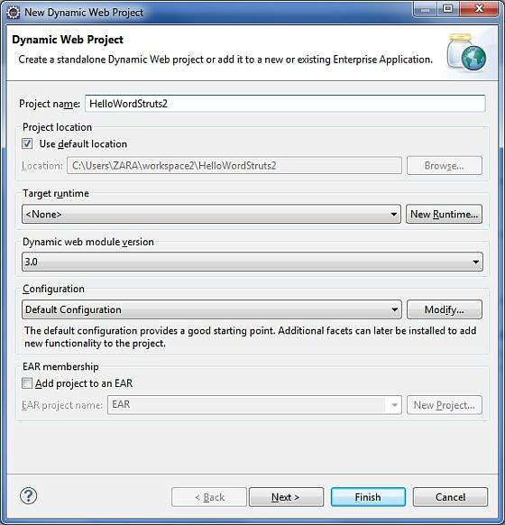

Struts 2 - Hello World Example
==============================

In this lab, we will build our first **Hello World Struts2** project.
The aim of this project is to build a web application that collects the
user\'s name and displays \"Hello World\" followed by the user name.

Create a Dynamic Web Project
----------------------------

Start your Eclipse and then go with **File \> New \> Dynamic Web Project** and enter project name as **HelloWorldStruts2** and set rest
of the options as given in the following screen −



Select all the default options in the next screens and finally check
**Generate Web.xml deployment descriptor** option. This will create a
dynamic web project for you in Eclipse. Now go with **Windows \> Show
View \> Project Explorer**, and you will see your project window
something as below −


Now copy following files from struts 2 lib folder
**C:\\struts-2.2.3\\lib** to our project\'s **WEB-INF\\lib** folder. To
do this, you can simply drag and drop all the following files into
WEB-INF\\lib folder.

-   commons-fileupload-x.y.z.jar
-   commons-io-x.y.z.jar
-   commons-lang-x.y.jar
-   commons-logging-x.y.z.jar
-   commons-logging-api-x.y.jar
-   freemarker-x.y.z.jar
-   javassist-.xy.z.GA
-   ognl-x.y.z.jar
-   struts2-core-x.y.z.jar
-   xwork-core.x.y.z.jar

Create Action Class
-------------------

Action class is the key to Struts 2 application and we implement most of
the business logic in action class. So let us create a java file
HelloWorldAction.java under **Java Resources \> src** with a package
name **com.fenago.struts2** with the contents given below.

The Action class responds to a user action when user clicks a URL. One
or more of the Action class\'s methods are executed and a String result
is returned. Based on the value of the result, a specific JSP page is
rendered.

```
package com.fenago.struts2;

public class HelloWorldAction {
   private String name;

   public String execute() throws Exception {
      return "success";
   }
   
   public String getName() {
      return name;
   }

   public void setName(String name) {
      this.name = name;
   }
}
```

This is a very simple class with one property called \"name\". We have
standard getters and setter methods for the \"name\" property and an
execute method that returns the string \"success\".

The Struts 2 framework will create an object of the **HelloWorldAction**
class and call the executed method in response to a user\'s action. You
put your business logic inside this method which finally returns the
String constant. In other words, for each URL, you would have to
implement one action class and either you can use that class name
directly as your action name or you can map to some other name using
struts.xml file as shown below.

Create a View
-------------

We need a JSP to present the final message, this page will be called by
Struts 2 framework when a predefined action will happen and this mapping
will be defined in struts.xml file. So let us create the below jsp file
**HelloWorld.jsp** in the WebContent folder in your eclipse project. To
do this, right click on the WebContent folder in the project explorer
and select **New \>JSP File**.

```
<%@ page contentType = "text/html; charset = UTF-8" %>
<%@ taglib prefix = "s" uri = "/struts-tags" %>

<html>
   <head>
      <title>Hello World</title>
   </head>
   
   <body>
      Hello World, <s:property value = "name"/>
   </body>
</html>
```

The taglib directive tells the Servlet container that this page will be
using the **Struts 2** tags and that these tags will be preceded by
**s**.

The s:property tag displays the value of action class property \"name\>
which is returned by the method **getName()** of the HelloWorldAction
class.

Create Main Page
----------------

We also need to create **index.jsp** in the WebContent folder. This file
will serve as the initial action URL where a user can click to tell the
Struts 2 framework to call a defined method of the HelloWorldAction
class and render the HelloWorld.jsp view.

```
<%@ page language = "java" contentType = "text/html; charset = ISO-8859-1"
   pageEncoding = "ISO-8859-1"%>
<%@ taglib prefix = "s" uri = "/struts-tags"%>
   <!DOCTYPE html PUBLIC "-//W3C//DTD HTML 4.01 Transitional//EN" 
"http://www.w3.org/TR/html4/loose.dtd">

<html>
   <head>
      <title>Hello World</title>
   </head>
   
   <body>
      <h1>Hello World From Struts2</h1>
      <form action = "hello">
         <label for = "name">Please enter your name</label><br/>
         <input type = "text" name = "name"/>
         <input type = "submit" value = "Say Hello"/>
      </form>
   </body>
</html>
```

The **hello** action defined in the above view file will be mapped to
the HelloWorldAction class and its execute method using struts.xml file.
When a user clicks on the Submit button it will cause the Struts 2
framework to run the execute method defined in the HelloWorldAction
class and based on the returned value of the method, an appropriate view
will be selected and rendered as a response.

Configuration Files
-------------------

Let us create a file called **struts.xml**. Since Struts 2 requires
struts.xml to be present in the classes folder. Hence, create struts.xml
file under the WebContent/WEB-INF/classes folder. Eclipse does not
create the \"classes\" folder by default, so you need to do this
yourself. To do this, right click on the WEB-INF folder in the project
explorer and select **New \> Folder**. Your struts.xml should look like
−

```
<?xml version = "1.0" Encoding = "UTF-8"?>
<!DOCTYPE struts PUBLIC
   "-//Apache Software Foundation//DTD Struts Configuration 2.0//EN"
   "http://struts.apache.org/dtds/struts-2.0.dtd">

<struts>
   <constant name = "struts.devMode" value = "true" />
   
   <package name = "helloworld" extends = "struts-default">
     <action name = "hello" 
         class = "com.fenago.struts2.HelloWorldAction" 
         method = "execute">
         <result name = "success">/HelloWorld.jsp</result>
      </action>
   </package>
</struts>
```


Creating a package is useful when you want to group your actions
together. In our example, we named our action as \"hello\" which is
corresponding to the URL **/hello.action** and is backed up by
the **HelloWorldAction.class**. The **execute** method of
**HelloWorldAction.class** is the method that is run when the URL
**/hello.action** is invoked. If the outcome of the execute method
returns \"success\", then we take the user to **HelloWorld.jsp**.

Next step is to create a **web.xml** file which is an entry point for
any request to Struts 2. The entry point of Struts2 application will be
a filter defined in deployment descriptor (web.xml). Hence, we will
define an entry of org.apache.struts2.dispatcher.FilterDispatcher class
in web.xml. The web.xml file needs to be created under the WEB-INF
folder under WebContent. Eclipse had already created a skeleton web.xml
file for you when you created the project. So, lets just modify it as
follows −

```
<?xml version = "1.0" Encoding = "UTF-8"?>
<web-app xmlns:xsi = "http://www.w3.org/2001/XMLSchema-instance"
   xmlns = "http://java.sun.com/xml/ns/javaee" 
   xmlns:web = "http://java.sun.com/xml/ns/javaee/web-app_2_5.xsd"
   xsi:schemaLocation = "http://java.sun.com/xml/ns/javaee 
   http://java.sun.com/xml/ns/javaee/web-app_3_0.xsd"
   id = "WebApp_ID" version = "3.0">
   
   <display-name>Struts 2</display-name>
   
   <welcome-file-list>
      <welcome-file>index.jsp</welcome-file>
   </welcome-file-list>
   
   <filter>
      <filter-name>struts2</filter-name>
      <filter-class>
         org.apache.struts2.dispatcher.FilterDispatcher
      </filter-class>
   </filter>

   <filter-mapping>
      <filter-name>struts2</filter-name>
      <url-pattern>/*</url-pattern>
   </filter-mapping>
</web-app>
```

We have specified index.jsp to be our welcome file. Then we have
configured the Struts2 filter to run on all urls (i.e, any url that
match the pattern /\*)

To Enable Detailed Log
----------------------

You can enable complete logging functionality while working with Struts
2 by creating **logging.properties** file under **WEB-INF/classes**
folder. Keep the following two lines in your property file −

```
org.apache.catalina.core.ContainerBase.[Catalina].level = INFO
org.apache.catalina.core.ContainerBase.[Catalina].handlers = \
   java.util.logging.ConsoleHandler
```


That\'s it. We are ready to run our Hello World application using Struts 2 framework.

Procedure for Executing the Application
---------------------------------------

Right click on the project name and click **Export \> WAR File** to
create a War file.

Then deploy this WAR in the Tomcat\'s webapps directory.

Finally, start Tomcat server and try to access URL
**http://localhost:8080/HelloWorldStruts2/index.jsp**. This will give
you following screen −


Enter a value \"Struts2\" and submit the page. You should see the next
page


Note that you can define **index** as an action in struts.xml file and
in that case you can call index page as
**http://localhost:8080/HelloWorldStruts2/index.action**. Check below
how you can define index as an action −

```
<?xml version = "1.0" Encoding = "UTF-8"?>
<!DOCTYPE struts PUBLIC
   "-//Apache Software Foundation//DTD Struts Configuration 2.0//EN"
   "http://struts.apache.org/dtds/struts-2.0.dtd">
<struts>
   <constant name = "struts.devMode" value = "true" />
   <package name = "helloworld" extends = "struts-default">

      <action name = "index">
         <result >/index.jsp</result>
      </action>

      <action name = "hello" 
         class = "com.fenago.struts2.HelloWorldAction" 
         method = "execute">
         <result name = "success">/HelloWorld.jsp</result>
      </action>

   </package>
</struts>
```

