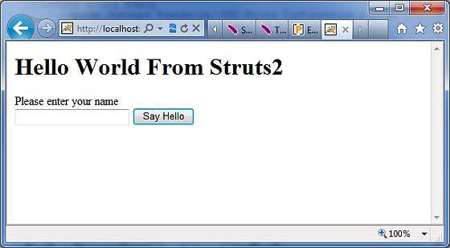
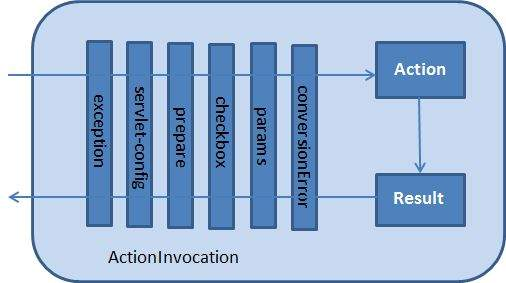

Struts 2 - Interceptors
=======================

------------------------------------------------------------------------


Interceptors are conceptually the same as servlet filters or the JDKs
Proxy class. Interceptors allow for crosscutting functionality to be
implemented separately from the action as well as the framework. You can
achieve the following using interceptors −

-   Providing preprocessing logic before the action is called.

-   Providing postprocessing logic after the action is called.

-   Catching exceptions so that alternate processing can be performed.

Many of the features provided in the **Struts2** framework are
implemented using interceptors;

**Examples** include exception handling, file uploading, lifecycle
callbacks, etc. In fact, as Struts2 emphasizes much of its functionality
on interceptors, it is not likely to have 7 or 8 interceptors assigned
per action.

Struts2 Framework Interceptors
------------------------------

Struts 2 framework provides a good list of out-of-the-box interceptors
that come preconfigured and ready to use. Few of the important
interceptors are listed below −

+-----------------------------------+-----------------------------------+
| Sr.No                             | Interceptor & Description         |
+===================================+===================================+
| 1                                 | **alias**                         |
|                                   |                                   |
|                                   | Allows parameters to have         |
|                                   | different name aliases across     |
|                                   | requests.                         |
+-----------------------------------+-----------------------------------+
| 2                                 | **checkbox**                      |
|                                   |                                   |
|                                   | Assists in managing check boxes   |
|                                   | by adding a parameter value of    |
|                                   | false for check boxes that are    |
|                                   | not checked.                      |
+-----------------------------------+-----------------------------------+
| 3                                 | **conversionError**               |
|                                   |                                   |
|                                   | Places error information from     |
|                                   | converting strings to parameter   |
|                                   | types into the action\'s field    |
|                                   | errors.                           |
+-----------------------------------+-----------------------------------+
| 4                                 | **createSession**                 |
|                                   |                                   |
|                                   | Automatically creates an HTTP     |
|                                   | session if one does not already   |
|                                   | exist.                            |
+-----------------------------------+-----------------------------------+
| 5                                 | **debugging**                     |
|                                   |                                   |
|                                   | Provides several different        |
|                                   | debugging screens to the          |
|                                   | developer.                        |
+-----------------------------------+-----------------------------------+
| 6                                 | **execAndWait**                   |
|                                   |                                   |
|                                   | Sends the user to an intermediary |
|                                   | waiting page while the action     |
|                                   | executes in the background.       |
+-----------------------------------+-----------------------------------+
| 7                                 | **exception**                     |
|                                   |                                   |
|                                   | Maps exceptions that are thrown   |
|                                   | from an action to a result,       |
|                                   | allowing automatic exception      |
|                                   | handling via redirection.         |
+-----------------------------------+-----------------------------------+
| 8                                 | **fileUpload**                    |
|                                   |                                   |
|                                   | Facilitates easy file uploading.  |
+-----------------------------------+-----------------------------------+
| 9                                 | **i18n**                          |
|                                   |                                   |
|                                   | Keeps track of the selected       |
|                                   | locale during a user\'s session.  |
+-----------------------------------+-----------------------------------+
| 10                                | **logger**                        |
|                                   |                                   |
|                                   | Provides simple logging by        |
|                                   | outputting the name of the action |
|                                   | being executed.                   |
+-----------------------------------+-----------------------------------+
| 11                                | **params**                        |
|                                   |                                   |
|                                   | Sets the request parameters on    |
|                                   | the action.                       |
+-----------------------------------+-----------------------------------+
| 12                                | **prepare**                       |
|                                   |                                   |
|                                   | This is typically used to do      |
|                                   | pre-processing work, such as      |
|                                   | setup database connections.       |
+-----------------------------------+-----------------------------------+
| 13                                | **profile**                       |
|                                   |                                   |
|                                   | Allows simple profiling           |
|                                   | information to be logged for      |
|                                   | actions.                          |
+-----------------------------------+-----------------------------------+
| 14                                | **scope**                         |
|                                   |                                   |
|                                   | Stores and retrieves the          |
|                                   | action\'s state in the session or |
|                                   | application scope.                |
+-----------------------------------+-----------------------------------+
| 15                                | **ServletConfig**                 |
|                                   |                                   |
|                                   | Provides the action with access   |
|                                   | to various servlet-based          |
|                                   | information.                      |
+-----------------------------------+-----------------------------------+
| 16                                | **timer**                         |
|                                   |                                   |
|                                   | Provides simple profiling         |
|                                   | information in the form of how    |
|                                   | long the action takes to execute. |
+-----------------------------------+-----------------------------------+
| 17                                | **token**                         |
|                                   |                                   |
|                                   | Checks the action for a valid     |
|                                   | token to prevent duplicate        |
|                                   | formsubmission.                   |
+-----------------------------------+-----------------------------------+
| 18                                | **validation**                    |
|                                   |                                   |
|                                   | Provides validation support for   |
|                                   | actions                           |
+-----------------------------------+-----------------------------------+

Please look into Struts 2 documentation for complete detail on the
abovementioned interceptors. But I will show you how to use an
interceptor in general in your Struts application.

How to Use Interceptors?
------------------------

Let us see how to use an already existing interceptor to our \"Hello
World\" program. We will use the **timer** interceptor whose purpose is
to measure how long it took to execute an action method. At the same
time, I\'m using **params** interceptor whose purpose is to send the
request parameters to the action. You can try your example without using
this interceptor and you will find that **name** property is not being
set because parameter is not able to reach to the action.

We will keep HelloWorldAction.java, web.xml, HelloWorld.jsp and
index.jsp files as they have been created in **Examples** chapter but
let us modify the **struts.xml** file to add an interceptor as follows −

```
<?xml version = "1.0" Encoding = "UTF-8"?>
<!DOCTYPE struts PUBLIC
   "-//Apache Software Foundation//DTD Struts Configuration 2.0//EN"
   "http://struts.apache.org/dtds/struts-2.0.dtd">
<struts>
   <constant name = "struts.devMode" value = "true" />
   
   <package name = "helloworld" extends = "struts-default">
      <action name = "hello" 
         class = "com.tutorialspoint.struts2.HelloWorldAction"
         method = "execute">
         <interceptor-ref name = "params"/>
         <interceptor-ref name = "timer" />
         <result name = "success">/HelloWorld.jsp</result>
      </action>
   </package>
</struts>
```

Right click on the project name and click **Export \> WAR File** to
create a War file. Then deploy this WAR in the Tomcat\'s webapps
directory. Finally, start Tomcat server and try to access URL
**http://localhost:8080/HelloWorldStruts2/index.jsp**. This will produce
the following screen −



Now enter any word in the given text box and click Say Hello button to
execute the defined action. Now if you will check the log generated, you
will find the following text −

```
INFO: Server startup in 3539 ms
27/08/2011 8:40:53 PM 
com.opensymphony.xwork2.util.logging.commons.CommonsLogger info
INFO: Executed action [//hello!execute] took 109 ms.
```

Here bottom line is being generated because of **timer** interceptor
which is telling that action took total 109ms to be executed.

Create Custom Interceptors
--------------------------

Using custom interceptors in your application is an elegant way to
provide crosscutting application features. Creating a custom interceptor
is easy; the interface that needs to be extended is the following
**Interceptor** interface −

```
public interface Interceptor extends Serializable {
   void destroy();
   void init();
   String intercept(ActionInvocation invocation)
   throws Exception;
}
```

As the names suggest, the init() method provides a way to initialize the
interceptor, and the destroy() method provides a facility for
interceptor cleanup. Unlike actions, interceptors are reused across
requests and need to be threadsafe, especially the intercept() method.

The **ActionInvocation** object provides access to the runtime
environment. It allows access to the action itself and methods to invoke
the action and determine whether the action has already been invoked.

If you have no need for initialization or cleanup code, the
**AbstractInterceptor** class can be extended. This provides a default
nooperation implementation of the init() and destroy() methods.

Create Interceptor Class
------------------------

Let us create the following MyInterceptor.java in **Java Resources \>
src** folder −

```
package com.tutorialspoint.struts2;

import java.util.*;
import com.opensymphony.xwork2.ActionInvocation;
import com.opensymphony.xwork2.interceptor.AbstractInterceptor;

public class MyInterceptor extends AbstractInterceptor {

   public String intercept(ActionInvocation invocation)throws Exception {

      /* let us do some pre-processing */
      String output = "Pre-Processing"; 
      System.out.println(output);

      /* let us call action or next interceptor */
      String result = invocation.invoke();

      /* let us do some post-processing */
      output = "Post-Processing"; 
      System.out.println(output);

      return result;
   }
}
```

As you notice, actual action will be executed using the interceptor by
**invocation.invoke()**call. So you can do some pre-processing and some
postprocessing based on your requirement.

The framework itself starts the process by making the first call to the
ActionInvocation object\'s invoke(). Each time **invoke()** is called,
ActionInvocation consults its state and executes whichever interceptor
comes next. When all of the configured interceptors have been invoked,
the invoke() method will cause the action itself to be executed.

The following diagram shows the same concept through a request flow −



Create Action Class
-------------------

Let us create a java file HelloWorldAction.java under **Java Resources
\> src** with a package name **com.tutorialspoint.struts2** with the
contents given below.

```
package com.tutorialspoint.struts2;

import com.opensymphony.xwork2.ActionSupport;

public class HelloWorldAction extends ActionSupport {
   private String name;

   public String execute() throws Exception {
      System.out.println("Inside action....");
      return "success";
   }  

   public String getName() {
      return name;
   }

   public void setName(String name) {
      this.name = name;
   }
}
```

This is a same class which we have seen in previous examples. We have
standard getters and setter methods for the \"name\" property and an
execute method that returns the string \"success\".

Create a View
-------------

Let us create the below jsp file **HelloWorld.jsp** in the WebContent
folder in your eclipse project.

```
<%@ page contentType = "text/html; charset = UTF-8" %>
<%@ taglib prefix = "s" uri = "/struts-tags" %>

<html>
   <head>
      <title>Hello World</title>
   </head>
   
   <body>
      Hello World, <s:property value = "name"/>
   </body>
</html>
```

Create Main Page
----------------

We also need to create **index.jsp** in the WebContent folder. This file
will serve as the initial action URL where a user can click to tell the
Struts 2 framework to call the a defined method of the HelloWorldAction
class and render the HelloWorld.jsp view.

```
<%@ page language = "java" contentType = "text/html; charset = ISO-8859-1"
   pageEncoding = "ISO-8859-1"%>
<%@ taglib prefix = "s" uri = "/struts-tags"%>
   <!DOCTYPE html PUBLIC "-//W3C//DTD HTML 4.01 Transitional//EN" 
   "http://www.w3.org/TR/html4/loose.dtd">

<html>
   <head>
      <title>Hello World</title>
   </head>
   
   <body>
      <h1>Hello World From Struts2</h1>
      <form action = "hello">
         <label for = "name">Please enter your name</label><br/>
         <input type = "text" name = "name"/>
         <input type = "submit" value = "Say Hello"/>
      </form>
   </body>
</html>
```

The **hello** action defined in the above view file will be mapped to
the HelloWorldAction class and its execute method using struts.xml file.

Configuration Files
-------------------

Now, we need to register our interceptor and then call it as we had
called default interceptor in previous example. To register a newly
defined interceptor, the \<interceptors\>\...\</interceptors\> tags are
placed directly under the \<package\> tag ins**struts.xml** file. You
can skip this step for a default interceptors as we did in our previous
example. But here let us register and use it as follows −

```
<?xml version = "1.0" Encoding = "UTF-8"?>
<!DOCTYPE struts PUBLIC
   "-//Apache Software Foundation//DTD Struts Configuration 2.0//EN"
   "http://struts.apache.org/dtds/struts-2.0.dtd">

<struts>
   <constant name = "struts.devMode" value = "true" />
   <package name = "helloworld" extends = "struts-default">

      <interceptors>
         <interceptor name = "myinterceptor"
            class = "com.tutorialspoint.struts2.MyInterceptor" />
      </interceptors>

      <action name = "hello" 
         class = "com.tutorialspoint.struts2.HelloWorldAction" 
         method = "execute">
         <interceptor-ref name = "params"/>
         <interceptor-ref name = "myinterceptor" />
         <result name = "success">/HelloWorld.jsp</result>
      </action>

   </package>
</struts>
```

It should be noted that you can register more than one interceptors
inside **\<package\>** tag and same time you can call more than one
interceptors inside the **\<action\>** tag. You can call same
interceptor with the different actions.

The web.xml file needs to be created under the WEB-INF folder under
WebContent as follows −

```
<?xml version = "1.0" Encoding = "UTF-8"?>
<web-app xmlns:xsi = "http://www.w3.org/2001/XMLSchema-instance"
   xmlns = "http://java.sun.com/xml/ns/javaee" 
   xmlns:web = "http://java.sun.com/xml/ns/javaee/web-app_2_5.xsd"
   xsi:schemaLocation = "http://java.sun.com/xml/ns/javaee 
   http://java.sun.com/xml/ns/javaee/web-app_3_0.xsd"
   id = "WebApp_ID" version = "3.0">
   
   <display-name>Struts 2</display-name>
   
   <welcome-file-list>
      <welcome-file>index.jsp</welcome-file>
   </welcome-file-list>
   
   <filter>
      <filter-name>struts2</filter-name>
      <filter-class>
         org.apache.struts2.dispatcher.FilterDispatcher
      </filter-class>
   </filter>

   <filter-mapping>
      <filter-name>struts2</filter-name>
      <url-pattern>/*</url-pattern>
   </filter-mapping>
</web-app>
```

Right click on the project name and click **Export \> WAR File** to
create a War file. Then deploy this WAR in the Tomcat\'s webapps
directory. Finally, start Tomcat server and try to access URL
**http://localhost:8080/HelloWorldStruts2/index.jsp**. This will produce
the following screen −


Now enter any word in the given text box and click Say Hello button to
execute the defined action. Now if you will check the log generated, you
will find the following text at the bottom −

```
Pre-Processing
Inside action....
Post-Processing
```

Stacking Multiple Interceptors
------------------------------

As you can imagine, having to configure multiple interceptor for each
action would quickly become extremely unmanageable. For this reason,
interceptors are managed with interceptor stacks. Here is an example,
directly from the strutsdefault.xml file −

```
<interceptor-stack name = "basicStack">
   <interceptor-ref name = "exception"/>
   <interceptor-ref name = "servlet-config"/>
   <interceptor-ref name = "prepare"/>
   <interceptor-ref name = "checkbox"/>
   <interceptor-ref name = "params"/>
   <interceptor-ref name = "conversionError"/>
</interceptor-stack>
```

The above stake is called **basicStack** and can be used in your
configuration as shown below. This configuration node is placed under
the \<package \.../\> node. Each \<interceptor-ref \.../\> tag
references either an interceptor or an interceptor stack that has been
configured before the current interceptor stack. It is therefore very
important to ensure that the name is unique across all interceptor and
interceptor stack configurations when configuring the initial
interceptors and interceptor stacks.

We have already seen how to apply interceptor to the action, applying
interceptor stacks is no different. In fact, we use exactly the same tag
−

```
<action name = "hello" class = "com.tutorialspoint.struts2.MyAction">
   <interceptor-ref name = "basicStack"/>
   <result>view.jsp</result>
</action
```

The above registration of \"basicStack\" will register complete stake of
all the six interceptors with hello action. This should be noted that
interceptors are executed in the order, in which they have been
configured. For example, in the above case, exception will be executed
first, second would be servlet-config and so on.

