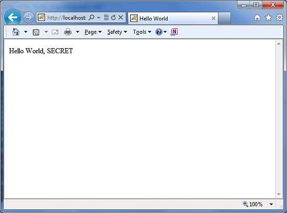
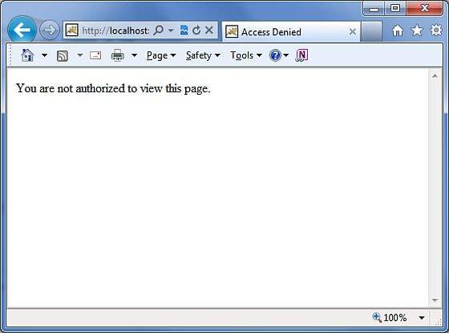

Struts 2 - Actions
==================

------------------------------------------------------------------------

**Actions** are the core of the Struts2 framework, as they are for any
MVC (Model View Controller) framework. Each URL is mapped to a specific
action, which provides the processing logic which is necessary to
service the request from the user.

But the action also serves in two other important capacities. Firstly,
the action plays an important role in the transfer of data from the
request through to the view, whether its a JSP or other type of result.
Secondly, the action must assist the framework in determining which
result should render the view that will be returned in the response to
the request.

Create Action
-------------

The only requirement for actions in **Struts2** is that there must be
one noargument method that returns either a String or Result object and
must be a POJO. If the no-argument method is not specified, the default
behavior is to use the execute() method.

Optionally you can extend the **ActionSupport** class which implements
six interfaces including **Action** interface. The Action interface is
as follows −

```
public interface Action {
   public static final String SUCCESS = "success";
   public static final String NONE = "none";
   public static final String ERROR = "error";
   public static final String INPUT = "input";
   public static final String LOGIN = "login";
   public String execute() throws Exception;
}
```

Let us take a look at the action method in the Hello World example −

```
package com.fenago.struts2;

public class HelloWorldAction {
   private String name;

   public String execute() throws Exception {
      return "success";
   }
   
   public String getName() {
      return name;
   }

   public void setName(String name) {
      this.name = name;
   }
}
```

To illustrate the point that the action method controls the view, let us
make the following change to the **execute** method and extend the class
ActionSupport as follows −

```
package com.fenago.struts2;

import com.opensymphony.xwork2.ActionSupport;

public class HelloWorldAction extends ActionSupport {
   private String name;

   public String execute() throws Exception {
      if ("SECRET".equals(name)) {
         return SUCCESS;
      } else {
         return ERROR;  
      }
   }
   
   public String getName() {
      return name;
   }

   public void setName(String name) {
      this.name = name;
   }
}
```

In this example, we have some logic in the execute method to look at the
name attribute. If the attribute equals to the string **\"SECRET\"**, we
return **SUCCESS** as the result otherwise we return **ERROR** as the
result. Because we have extended ActionSupport, so we can use String
constants **SUCCESS** and ERROR. Now, let us modify our struts.xml file
as follows −

```
<?xml version = "1.0" Encoding = "UTF-8"?>
<!DOCTYPE struts PUBLIC
   "-//Apache Software Foundation//DTD Struts Configuration 2.0//EN"
   "http://struts.apache.org/dtds/struts-2.0.dtd">

<struts>
   <constant name = "struts.devMode" value = "true" />
   <package name = "helloworld" extends = "struts-default">
      <action name = "hello" 
         class = "com.fenago.struts2.HelloWorldAction"
         method = "execute">
         <result name = "success">/HelloWorld.jsp</result>
         <result name = "error">/AccessDenied.jsp</result>
      </action>
   </package>
</struts>
```

Create a View
-------------

Let us create the below jsp file **HelloWorld.jsp** in the WebContent
folder in your eclipse project. To do this, right click on the
WebContent folder in the project explorer and select **New \>JSP File**.
This file will be called in case return result is SUCCESS which is a
String constant \"success\" as defined in Action interface −

```
<%@ page contentType = "text/html; charset = UTF-8" %>
<%@ taglib prefix = "s" uri = "/struts-tags" %>

<html>
   <head>
      <title>Hello World</title>
   </head>
   
   <body>
      Hello World, <s:property value = "name"/>
   </body>
</html>
```

Following is the file which will be invoked by the framework in case
action result is ERROR which is equal to String constant \"error\".
Following is the content of **AccessDenied.jsp**

```
<%@ page contentType = "text/html; charset = UTF-8" %>
<%@ taglib prefix = "s" uri = "/struts-tags" %>

<html>  
   <head>
      <title>Access Denied</title>
   </head>
   
   <body>
      You are not authorized to view this page.
   </body>
</html>
```

We also need to create **index.jsp** in the WebContent folder. This file
will serve as the initial action URL where the user can click to tell
the Struts 2 framework to call the **execute**method of the
HelloWorldAction class and render the HelloWorld.jsp view.

```
<%@ page language = "java" contentType = "text/html; charset = ISO-8859-1"
   pageEncoding = "ISO-8859-1"%>
<%@ taglib prefix = "s" uri = "/struts-tags"%>
   <!DOCTYPE html PUBLIC "-//W3C//DTD HTML 4.01 Transitional//EN" 
   "http://www.w3.org/TR/html4/loose.dtd">

<html>  
   <head>
      <title>Hello World</title>
   </head>
   
   <body>
      <h1>Hello World From Struts2</h1>
      <form action = "hello">
         <label for = "name">Please enter your name</label><br/>
         <input type = "text" name = "name"/>
         <input type = "submit" value = "Say Hello"/>
      </form>
   </body>
</html>
```

That\'s it, there is no change required for web.xml file, so let us use
the same web.xml which we had created in **Examples** chapter. Now, we
are ready to run our **Hello World** application using Struts 2
framework.

Execute the Application
-----------------------

Right click on the project name and click **Export \> WAR** File to
create a War file. Then deploy this WAR in the Tomcat\'s webapps
directory. Finally, start Tomcat server and try to access URL
**http://localhost:8080/HelloWorldStruts2/index.jsp**. This will give
you following screen −


Let us enter a word as \"SECRET\" and you should see the following page
−



Now enter any word other than \"SECRET\" and you should see the
following page −



Create Multiple Actions
-----------------------

You will frequently define more than one actions to handle different
requests and to provide different URLs to the users, accordingly you
will define different classes as defined below −

```
package com.fenago.struts2;
import com.opensymphony.xwork2.ActionSupport;

class MyAction extends ActionSupport {
   public static String GOOD = SUCCESS;
   public static String BAD = ERROR;
}

public class HelloWorld extends ActionSupport {
   ...
   public String execute() {
      if ("SECRET".equals(name)) return MyAction.GOOD;
      return MyAction.BAD;
   }
   ...
}

public class SomeOtherClass extends ActionSupport {
   ...
   public String execute() {
      return MyAction.GOOD;
   }
   ...
}
```

You will configure these actions in struts.xml file as follows −

```
<?xml version = "1.0" Encoding = "UTF-8"?>
<!DOCTYPE struts PUBLIC
   "-//Apache Software Foundation//DTD Struts Configuration 2.0//EN"
   "http://struts.apache.org/dtds/struts-2.0.dtd">

<struts>
   <constant name = "struts.devMode" value = "true" />
   
   <package name = "helloworld" extends = "struts-default">
      <action name = "hello" 
         class = "com.fenago.struts2.HelloWorld" 
         method = "execute">
         <result name = "success">/HelloWorld.jsp</result>
         <result name = "error">/AccessDenied.jsp</result>
      </action>
      
      <action name = "something" 
         class = "com.fenago.struts2.SomeOtherClass" 
         method = "execute">
         <result name = "success">/Something.jsp</result>
         <result name = "error">/AccessDenied.jsp</result>
      </action>
   </package>
</struts>
```

As you can see in the above hypothetical example, the action results
**SUCCESS** and **ERROR's** are duplicated.

To get around this issue, it is suggested that you create a class which
contains the result outcomes.

