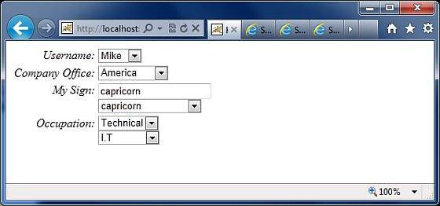

Struts 2 - The Form Tags
========================

------------------------------------------------------------------------


The list of **form** tags is a subset of Struts UI Tags. These tags help
in the rendering of the user interface required for the Struts web
applications and can be categorised into three categories. This chapter
will take you thorugh all the three types of UI tags −

Simple UI Tags
--------------

We have used these tags in our examples already, we will brush them in
this chapter. Let us look a simple view page **email.jsp** with several
simple UI tags −

```
<%@ page language = "java" contentType = "text/html; charset = ISO-8859-1"
   pageEncoding = "ISO-8859-1"%>
<%@ taglib prefix = "s" uri = "/struts-tags"%>
<!DOCTYPE html PUBLIC "-//W3C//DTD HTML 4.01 Transitional//EN" 
   "http://www.w3.org/TR/html4/loose.dtd">

<html>
   <head>
      <s:head/>
      <title>Hello World</title>
   </head>
   
   <body>
      <s:div>Email Form</s:div>
      <s:text name = "Please fill in the form below:" />
      
      <s:form action = "hello" method = "post" enctype = "multipart/form-data">
         <s:hidden name = "secret" value = "abracadabra"/>
         <s:textfield key = "email.from" name = "from" />
         <s:password key = "email.password" name = "password" />
         <s:textfield key = "email.to" name = "to" />
         <s:textfield key = "email.subject" name = "subject" />
         <s:textarea key = "email.body" name = "email.body" />
         <s:label for = "attachment" value = "Attachment"/>
         <s:file name = "attachment" accept = "text/html,text/plain" />
         <s:token />
         <s:submit key = "submit" />
      </s:form>
      
   </body>
</html>
```

If you are aware of HTML, then all the tags used are very common HTML
tags with an additional prefix **s:** along with each tag and different
attributes. When we execute the above program, we get the following user
interface provided you have setup proper mapping for all the keys used.


As shown, the s:head generates the javascript and stylesheet elements
required for the Struts2 application.

Next, we have the s:div and s:text elements. The s:div is used to render
a HTML Div element. This is useful for people who do not like to mix
HTML and Struts tags together. For those people, they have the choice to
use s:div to render a div.

The s:text as shown is used to render a text on the screen.

Next we have the famiilar s:form tag. The s:form tag has an action
attribute that determines where to submit the form. Because we have a
file upload element in the form, we have to set the enctype to
multipart. Otherwise, we can leave this blank.

At the end of the form tag, we have the s:submit tag. This is used to
submit the form. When the form is submitted, all the form values are
submitted to the the action specified in the s:form tag.

Inside the s:form, we have a hidden attribute called secret. This
renders a hidden element in the HTML. In our case, the \"secret\"
element has the value \"abracadabra\". This element is not visible to
the end user and is used to carry the state from one view to another.

Next we have the s:label, s:textfield, s:password and s:textarea tags.
These are used to render the label, input field, password and the text
area respectively. We have seen these in action in the \"Struts -
Sending Email\" example.

The important thing to note here is the use of \"key\" attribute. The
\"key\" attribute is used to fetch the label for these controls from the
property file. We have already covered this feature in the Struts2
Localization, internationalization chapter.

Then, we have the s:file tag which renders a input file upload
component. This component allows the user to upload files. In this
example, we have used the \"accept\" parameter of the s:file tag to
specify which file types are allowed to be uploaded.

Finally we have the s:token tag. The token tag generates an unique token
which is used to find out whether a form has been double submitted

When the form is rendered, a hidden variable is placed as the token
value. Let us say, for example that the token is \"ABC\". When this form
is submitted, the Struts Fitler checks the token against the token
stored in the session. If it matches, it removes the token from the
session. Now, if the form is accidentally resubmitted (either by
refreshing or by hitting the browser back button), the form will be
resubmitted with \"ABC\" as the token. In this case, the filter checks
the token against the token stored in the session again. But because the
token \"ABC\" has been removed from the session, it will not match and
the Struts filter will reject the request.

Group UI Tags
-------------

The group UI tags are used to create radio button and the checkbox. Let
us look a simple view page **HelloWorld.jsp** with check box and radio
button tags −

```
<%@ page contentType = "text/html; charset = UTF-8"%>
<%@ taglib prefix = "s" uri = "/struts-tags"%>

<html>
   <head>
      <title>Hello World</title>
      <s:head />
   </head>
   
   <body>
      <s:form action = "hello.action">
         <s:radio label = "Gender" name = "gender" list="{'male','female'}" />
         <s:checkboxlist label = "Hobbies" name = "hobbies"
         list = "{'sports','tv','shopping'}" />
      </s:form>
      
   </body>
</html>
```

When we execute the above program, our output will look similar to the
following −


Let us look at the example now. In the first example, we are creating a
simple radio button with the label \"Gender\". The name attribute is
mandatory for the radio button tag, so we specify a name which is
\"gender\". We then supply a list to the gender. The list is populated
with the values \"male\" and \"female\". Therefore, in the output we get
a radio button with two values in it.

In the second example, we are creating a checkbox list. This is to
gather the user\'s hobbies. The user can have more than one hobby and
therefore we are using the checkbox instead of the radiobutton. The
checkbox is populated with the list \"sports\", \"TV\" and \"Shopping\".
This presents the hobbies as a checkbox list.

Select UI Tags
--------------

Let us explore the different variations of the Select Tag offered by
Struts. Let us look a simple view page **HelloWorld.jsp** with select
tags −

```
<%@ page contentType = "text/html; charset = UTF-8"%>
<%@ taglib prefix = "s" uri = "/struts-tags"%>

<html>
   <head>
      <title>Hello World</title>
      <s:head />
   </head>
   
   <body>
      <s:form action = "login.action">
         <s:select name = "username" label = "Username"
            list = "{'Mike','John','Smith'}" />

         <s:select label = "Company Office" name = "mySelection"
            value = "%{'America'}" list="%{#{'America':'America'}}">
            <s:optgroup label = "Asia" 
               list = "%{#{'India':'India','China':'China'}}" />
            <s:optgroup label = "Europe"
               list="%{#{'UK':'UK','Sweden':'Sweden','Italy':'Italy'}}" />
         </s:select>

         <s:combobox label = "My Sign" name = "mySign"
            list = "#{'aries':'aries','capricorn':'capricorn'}" headerkey = "-1" 
            headervalue = "--- Please Select ---" emptyOption = "true" value = "capricorn" />
         <s:doubleselect label = "Occupation" name = "occupation"
            list = "{'Technical','Other'}" doublename = "occupations2"
            doubleList="top == 'Technical' ? 
            {'I.T', 'Hardware'} : {'Accounting', 'H.R'}" />
      </s:form>
   </body>
</html>
```

When we execute the above program our output will look similar to the
following −



Let us now go through the individual cases, one by one.

-   First, the select tag renders the HTML select box. In the first
    example, we are creating a simple select box with name \"username\"
    and the label \"username\". The select box will be populated with a
    list that contains the names Mike, John and Smith.

-   In the second example, our company has head offices in America. It
    also has global offices in Asia and Europe. We want to display the
    offices in a select box but we want to group the global offices by
    the name of the continent. This is where the optgroup comes in
    handy. We use the s:optgroup tag to create a new group. We give the
    group a label and a separate list.

-   In the third example, the combobox is used. A combo box is a
    combination of an input field and a select box. The user can either
    select a value from the select box in which case the input field is
    automatically filled in with the value the user has selected. Should
    the user to enter a value directly, no values from the select box
    will be selected.

-   In our example we have the combobox listing the sun signs. The
    selectbox lists only four entries allowing the user to type in his
    sun sign if it is not in the list. We also add a header entry to the
    select box. The headerentry is the one that is displayed at the top
    of the select box. In our case we want to display \"Please Select\".
    If the user does not select anything, then we assume -1 as the
    value. In some cases, we do not want the user to select an empty
    value. In those conditions, one would set the \"emptyOption\"
    property to false. Finally, in our example we supply \"capricorn\"
    as the default value for the combobox.

-   In the fourth example, we have a double select. A double select is
    used when you want to display two select boxes. The value selected
    in the first select box determines what appears in the second select
    box. In our example the first select box displays \"Technical\" and
    \"Other\". If the user selects Technical, we will display IT and
    Hardware in the second select box. Otherwise we will display
    Accounting and HR. This is possible using the \"list\" and
    \"doubleList\" atrributes as shown in the example.

In the above example, we did a comparison to see if the top select box
equals Technical. If it does, then we display IT and Hardware.

We also need to give a name for the top box (\"name = \'Occupations\')
and the bottom box (doubleName = \'occupations2\')

